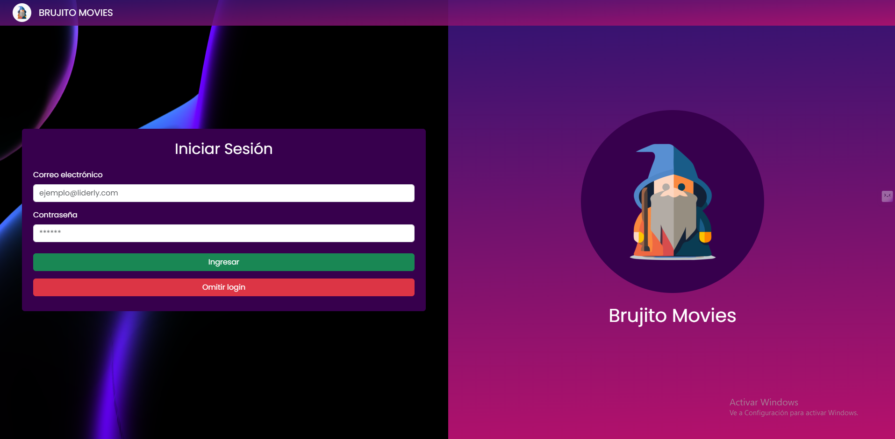
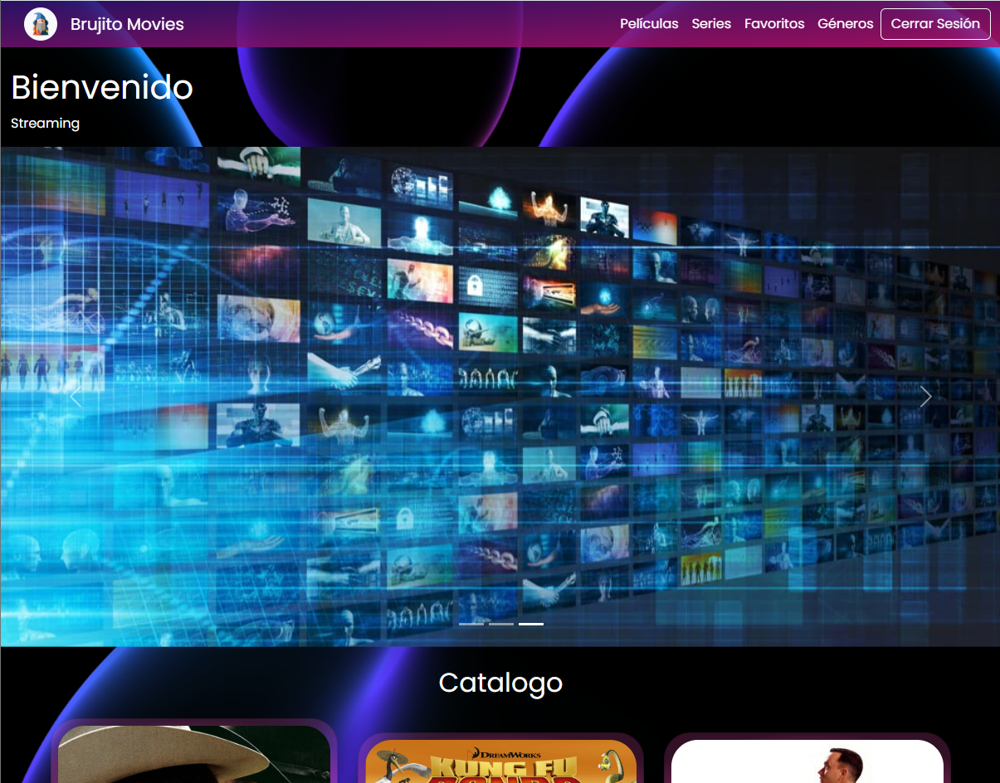
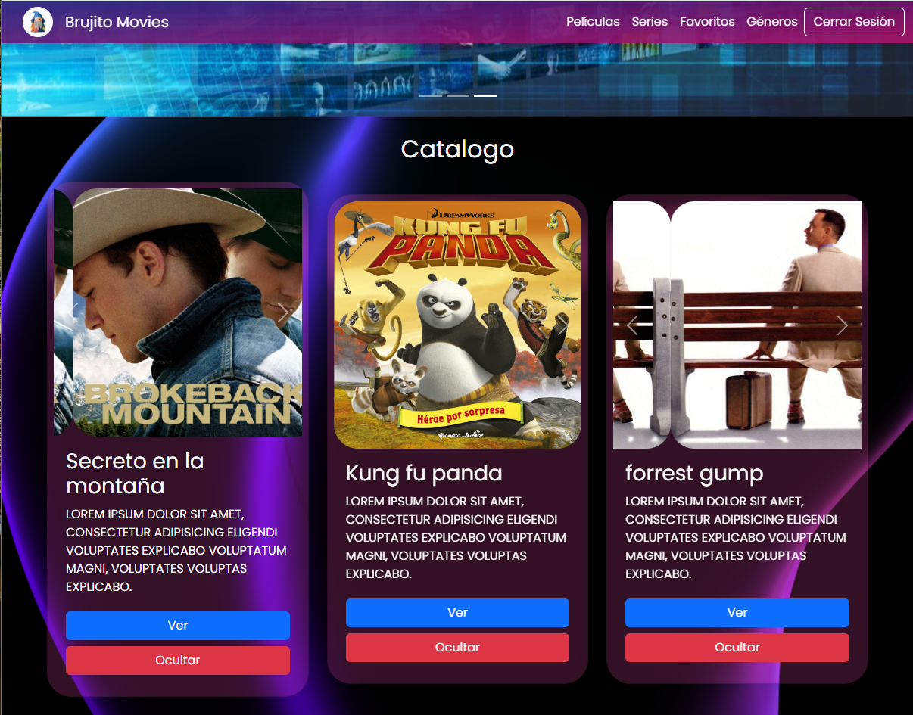
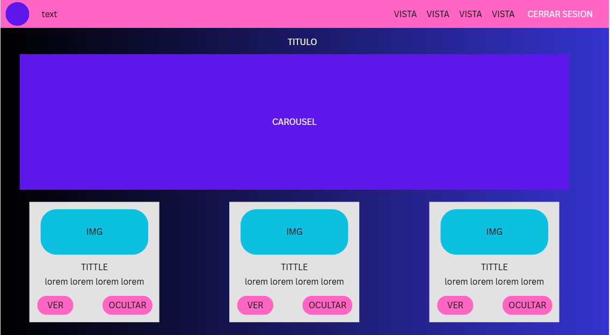
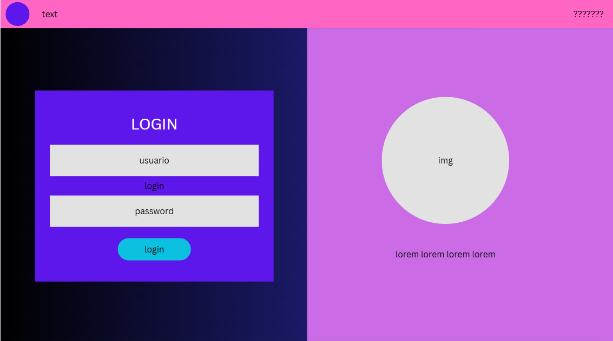

# Streaming-AML
Streaming service

# TITULO: 
Brujito movies

# DESCRIPTION: 
Plataforma de streaming

#  CAPTURAS DE PANTALLA DEL PROYECTO

# MOCKUP

# DESCARGA EL REPO
1. Entra al repo https://github.com/ADRIANMEDINALIMON/Streaming-AML
2. clic en el botón verde Code
3. Luego haz clic en Download ZIP
4. Extrae el archivo ZIP
5. Dentro de la carpeta descomprimida, busca el archivo llamado index.html.
6. Abrelo con live server o lo puedes deslizar a tu navegador para abrirlo

# DESCRIPCION
Inicie haciendo el MOCKUP para hacerme una idea
Hice el repo
Inicie con index.html css y js 
El navbar junto con el componente de cards, me base en bootstrap para el responsive y css principalmente 
Harcodie las cards y despues las hice dinamicas para consumir info de un json con texto he img, le anexe un carousel para que no se vea tan solo
Despues hice el login y meti validaciones para ingresar, pero no obvio no autentifica credenciales solo simula
Meti las funciones y enrutado para que tenga un flujo logico

# PROBLEMAS 
En las cards tuve problemas con el bloques dinamicos de HTML y el json, al final pude resolver 
Tambien con las validacion de los inputs del login para validar el email, pero al final todo ok

# Que hice bien...
El Diseño me gusto

# Que no salio bien...
Las cards y creo que cometi malas practicas en mi codigo 

# Que puedo hacer diferente...
Mejorar mi codigo, siento que me falto organizar mejor, hacer dinamico algunos bloques de codigo y el responsive